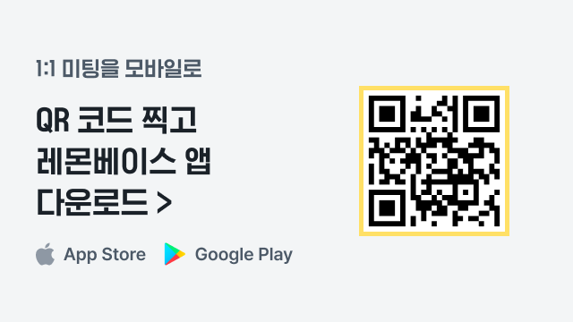

# 기타

## 영어 버전은 없나요? 

아직 영어 버전을 지원하고 있지는 않습니다.

하지만 구글 번역 프로그램을 활용할 수 있습니다. 실제로 해외 지사나 외국인 직원 분들이 있는 고객사에서 잘 사용하고 있습니다.

1. 크롬 웹 스토어에서 **'**[**구글 번역(클릭)**](https://chrome.google.com/webstore/detail/google-translate/aapbdbdomjkkjkaonfhkkikfgjllcleb)**'을 검색하여 다운로드 받고 확장 프로그램에 추가**합니다.

 (2).png>)

2. 크롬 상단의 주소 입력 상자 옆에 **'확장 프로그램 - 구글 번역'을 클릭해서 '이 페이지 번역하기'를 누르고, 도착어를 영어로 설정**합니다.

 (3).png>)

 (2).png>)

3. 번역된 레몬베이스를 이용할 수 있습니다.

 (2).png>)

## 혼자 어떻게 테스트할 수 있나요? 

어드민 혼자서 레몬베이스 테스트를 하는 경우, 하나의 계정으로는 온전히 테스트하기 어려운 기능들도 있어요. 그렇기 때문에 2명 이상의 테스트 구성원을 등록하는 것을 권장합니다.

#### 1. 쉽게 테스트 계정 만들기

#### **Gmail, Outlook을 사용하는 경우**

`+` 기능을 사용해 보세요. 기존 이메일 주소를 기반으로 테스트 계정을 만들 수 있습니다.

 (2).png>)

\[예시] 기존 계정에 +를 붙여서 레몬베이스에 테스트 구성원을 등록하세요. 구성원 계정은 여러 개로 인식되지만 알림 메일 등은 기존 계정으로만 옵니다!

[biz@lemonbase.com](mailto:biz@lemonbase.com) `기존 계정`

[biz+demo1@lemonbase.com](mailto:biz+demo1@lemonbase.com)

[biz+demo2@lemonbase.com](mailto:biz+demo2@lemonbase.com)


**Gmail, Outlook을 사용하지 않는 경우**

회사의 그룹 메일([hr@lemonbase.com](mailto:hr@lemonbase.com))이 있다면, 그룹 메일을 테스트 계정으로 사용해 보세요. 또는 테스트에 사용할 메일 계정을 새롭게 생성하여 구성원으로 등록해 주세요.


#### 2. 여러 계정을 동시에 테스트하기

테스트 시 다양한 입장(예: 어드민 / 경영진 / 리더 / 구성원 등)으로 로그인하는 것이 필요합니다.

이 때, 로그인-로그아웃을 반복할 필요 없이 쉽게 테스트할 수 있는 방법을 안내드립니다.

크롬과 파이어폭스 중 편한 방법으로 골라 사용해 보세요!

**크롬에서 여러 계정을 사용하는 방법**

크롬에서 각자 다른 계정으로 로그인 된 창을 여러 개 띄울 수 있습니다.

1. 크롬 주소창 상단 우측의 `프로필`을 클릭해 주세요.
2.  `다른 사용자` > `추가`를 클릭해 주세요.

     (3).png>)
3.  `계정 없이 계속` 버튼을 클릭해 주세요.

     (2).png>)
4.  사용자 이름을 설정하고 바탕화면에 바로가기를 만들어주세요.

     (2).png>)
5.  만들어진 사용자 브라우저로 레몬베이스에 접속하여 로그인하면 이후에는 바로 해당 사용자로 로그인이 됩니다.

     (2).png>)

     (3).png>)

**Firefox에서 탭별로 다른 계정으로 로그인하기**

여러 창을 띄우기 번거롭다면 하나의 창에서 여러 탭을 띄울 수 있습니다.

1. Firefox에서 [Firefox Multi-Account Containers 확장 프로그램](https://addons.mozilla.org/ko/firefox/addon/multi-account-containers/)을 설치해 주세요.
2.  Firefox 우측 상단에서 컨테이너 설정 (+ 버튼 / Edit Containers 이용)

     (2).png>)
3.  탭 추가 버튼을 꾹 누르고 원하는 컨테이너로 새 탭을 띄운 뒤 탭마다 다른 계정으로 로그인 해주세요.

     (2).png>)
4.  탭 이동만으로 여러 계정을 동시에 테스트할 수 있습니다.

     (2).png>)

####

## 모바일에서 레몬베이스를 이용할 수 있나요? 

모바일App/Web에서 레몬베이스를 이용해 보세요! 🙂

App, Web에서 각자 어떤 것을 할 수 있는지 소개해드릴게요.

#### 모바일 App에서 무엇을 할 수 있나요?

* `1:1 미팅` 새로운 미팅 스케줄을 만들고 모든 미팅 스케줄을 확인할 수 있습니다.
* `1:1 미팅` 남겨진 미팅 기록(어젠다, 코멘트, 메모)을 열람할 수 있습니다.
* `1:1 미팅` 미팅을 진행하며 다루어진 어젠다를 체크할 수 있습니다.
* `1:1 미팅` 어젠다와 코멘트를 등록, 수정, 삭제할 수 있습니다.
* `1:1 미팅` 새로운 공유 / 비공개 메모를 등록, 수정, 삭제할 수 있습니다.

**왜 모바일에서 1:1 미팅을 먼저 지원하나요?**

OKR, 나아가 ‘지속적인 성과 관리’ 문화가 확고하게 자리 잡기 위해서는 일상적인 CFR 활동(Conversation - Feedback - Recognition)이 매우 중요한데요. 이 중에서 특히 리더-팀원 간의 1:1 미팅(Conversation)은 목표 얼라인, 진척 상황 확인과 즉각적인 문제 해결, 지속적인 동기부여를 위한 핵심 활동입니다. 1:1 미팅이 왜 중요한지, 어떻게 더 잘 할 수 있는지 궁금하다면, [전문가가 제공하는 레몬베이스 캠프 콘텐츠](https://camp.lemonbase.com/list/1on1)를 참고해 주세요!

1:1 미팅은 최근 월간 10,000개 이상의 어젠다(22년 3월 기준)가 다루어질 정도로, 레몬베이스 사용자가 가장 활발하게 활용해 주시는 기능이기도 합니다. 지금까지는 Desktop 지원만 되어서 노트북을 펼쳐놓고 1:1 미팅을 진행해야 되는 약간의 아쉬움이 있었는데요. 때문에 정말 많은 분들이 모바일 지원을 요청해 주셨어요.

앞으로 1:1 미팅 외에도 더 많은 기능들이 꾸준히 추가될 예정이니 많은 응원과 피드백 부탁드립니다! 💪

#### 레몬베이스 App 다운로드 방법

 (2).png>)

 (2).png>)

#### 모바일 Web에서 무엇을 할 수 있나요?

PC로 할 수 있는 모든 것들을 모바일로 할 수 있어요. 모바일 최적화는 조금 더 기다려 주세요!

#### 모바일 Web 이용 방법

 (2).png>)

## 구성원들에게 자동으로 발송되는 메일이 어떤 게 있나요? 

#### 리뷰

#### 사전 점검 → 동료 지정

* 동료를 지정하라는 내용의 메일이 발송됩니다. `커스텀 가능`
  *   동료 지정 방식이 ‘리뷰 대상자가 지정’할 때 → 리뷰 대상자에게 메일 발송

       (2).png>)
  *   동료 지정 방식이 ‘리뷰 대상자의 리더가 지정’할 때 → 리뷰 대상자의 리더에게 메일 발송

       (2).png>)
* 동료 지정 확인 / 승인 요청 `커스텀 불가`
  *   동료 지정 방식이 ‘리뷰 대상자 지정이나 리더 승인이 불필요’할 때 → 리뷰 대상자의 리더에게 메일 발송

       (2).png>)
  *   동료 지정 방식이 ‘리뷰 대상자가 지정 후 리더 승인 필요’할 때 → 리뷰 대상자의 리더에게 메일 발송

       (2).png>)
* 동료 지정 반려 `커스텀 불가`
  *   동료 지정 방식이 ‘리뷰 대상자가 지정 후 리더 승인 필요’할 때 → 리뷰 대상자의 리더가 반려 후 리뷰 대상자에게 메일 발송

       (2).png>)
* 동료 지정 승인 완료 `커스텀 불가`
  *   동료 지정 방식이 ‘리뷰 대상자가 지정 후 리더 승인 필요’할 때 → 리뷰 대상자의 리더가 승인 후 리뷰 대상자에게 메일 발송

       (2).png>)

#### 사전 점검 or 동료 지정 → 리뷰 작성

* 리뷰를 작성하라는 알림 `커스텀 가능`
  *   해당 사이클의 리뷰 작성자들에게 메일 발송

       (2).png>)

#### 리뷰 작성 or 캘리브레이션 → 결과 확인

* 결과를 확인하라는 알림 `커스텀 불가`
  *   리더가 공유하는 방식일 때

       (1).png>)

       (2).png>)
  *   어드민이 공유하는 방식일 때

       (2).png>)

#### 목표

* 목표 추가, 삭제, 수정, 체크인, 코멘트에 대한 변경 사항이 생길때
  *   해당 목표의 담당자와 알림을 받는 사람에게 이메일이 전송됩니다. 목표 담당자의 조직리더로 설정된 사람은 자동으로 알림 받는 사람으로 지정됩니다.

       (1).png>)

       (2).png>)

       (2).png>)

       (2).png>)

       (2).png>)
  *   \[목표를 세운 후 리더와 합의 필요]의 경우, \[조직 리더]에게 목표 합의 요청 이메일이 전송됩니다.

      ![\[조직 리더\]에게 목표 합의 요청 이메일](<../.gitbook/assets/Untitled (59) (1).png>)
* 어드민 페이지의 목표 관리 페이지에서 사이클 오른쪽 🛎️(`체크인 리마인드`) 클릭 > `전송` 클릭 시, 체크인 리마인드 이메일 전송됩니다.
  *   목표 사이클에서 담당하고 있는 목표가 있는 구성원에게 메일이 발송됩니다.

       (2).png>)

       (1).png>)

       (1).png>)
* 목표 알림 발송 시점 및 더 자세한 내용이 궁금하다면[ 문서](https://www.notion.so/e7d3d5dc30834b55a83902b7dc410389)\*\*를 확인해 주세요!


💡 목표에 대한 변경사항에 대한 노이즈를 막기 위해 구성원이 직접 목표 알림을 해제할 수 있습니다. ([헬프센터 링크](https://help.lemonbase.com/2299585c-209d-4eb8-afd7-d8537bcfabe6))

어드민이 직접 목표 기능 알림 해제는 불가하며, 구성원 개개인이 직접 설정해주셔야 합니다.

다만, 구성원이 목표 기능 알림 해제를 했어도 어드민 페이지에서 `목표 관리` > `체크인 리마인드` 알림은 구성원에게 이메일 발송됩니다.


#### 1:1 미팅

* 1:1 미팅 생성 직후 `알림 보내기` 창 생성 > `알림 보내기` 버튼을 누를 시,
  *   미팅 상대방에게 이메일이 발송됩니다.

       (2).png>)

       (2).png>)
* 1:1 미팅에서 나누고 싶은 어젠다를 미팅 대상자에게 미리 공유하고 싶은 경우
  *   미팅 상대방에게 이메일이 발송됩니다.

      1. 1:1에서 나누고 싶은 어젠다 작성
      2. 🛎️(미팅 보드 확인 알림 보내기) 버튼 클릭
      3. 알림 보내기 팝업 창에서 보내기 버튼까지 클릭하면, 이메일이 발송됩니다.

       (1).png>)

       (1).png>)

       (1).png>)

#### 피드백

*   피드백을 받을 때마다 자동으로 이메일이 발송됩니다.

     (1).png>)

## 레몬베이스와 연동 가능한 앱과 API가 있나요? 

 (5).png>)

**SAML SSO**

SAML SSO를 활성화하면 레몬베이스에서 사용자를 안전하게 인증할 수 있습니다.

SAML SSO를 연동하는 법이 궁금하다면 [**이 문서**](https://www.notion.so/SSO-127f67e757c341e58a019c0a7528eec9)를 확인해 주세요!

#### Lemonbase API

Lemonbase Open API를 활용하여 구성원 데이터를 레몬베이스로 가져오거나 내보낼 수 있습니다.

기존 ERP나 HR 솔루션과의 연동을 통해 구성원 정보를 손쉽게 관리하세요.

