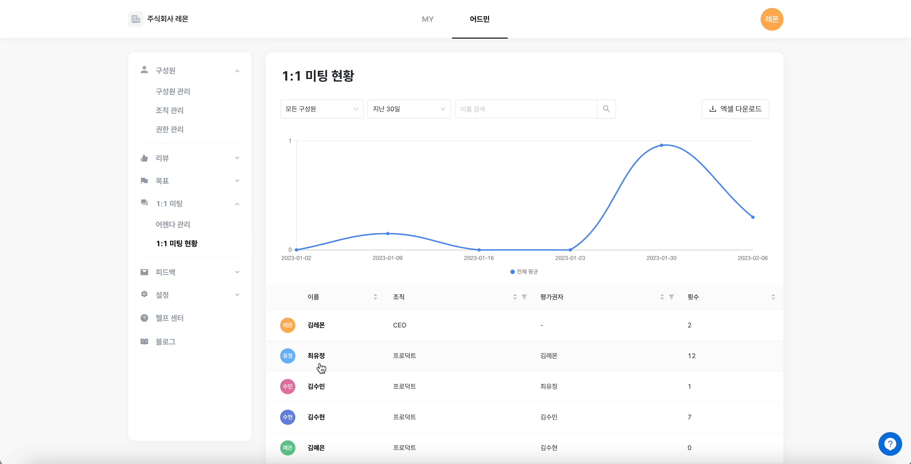

# 1:1 미팅 현황

## 1:1 미팅 현황 확인하기 

`어드민` > `1:1 미팅 현황` 페이지를 통해 구성원들이 1:1 미팅을 어떤 주기, 어떤 내용으로 진행하고 있는지 확인하고, 1:1 미팅을 더 잘 할 수 있도록 독려해 주세요.

1.  구성원의 이름을 클릭하면, 이 사람이 누구와 언제 1:1 미팅을 진행했는지 알 수 있습니다.

    
2.  `보기` 버튼을 누르면, 비공개 메모를 제외한 상세 미팅 내용을 확인할 수 있습니다.

    .gif>)
3.  조직 리더들이 팀원들과 1:1 미팅을 얼마나 했는지 확인하고 싶다면, 상단의 `조직 리더` 탭을 클릭해 주세요. 조직 별로 1:1 미팅을 얼마나 했는지 확인하고 싶다면, `조직` 탭을 클릭해 주세요. `조직 리더` 및 `조직` 탭을 클릭하면, \[조직 리더]나 \[조직]도 검색 가능합니다.

    .png>)
4.  `엑셀 다운로드`를 통해 확인할 수도 있습니다. 단, \[상세 미팅 내용]은 엑셀에서 확인이 불가합니다.

    <figure><figcaption></figcaption></figure>
