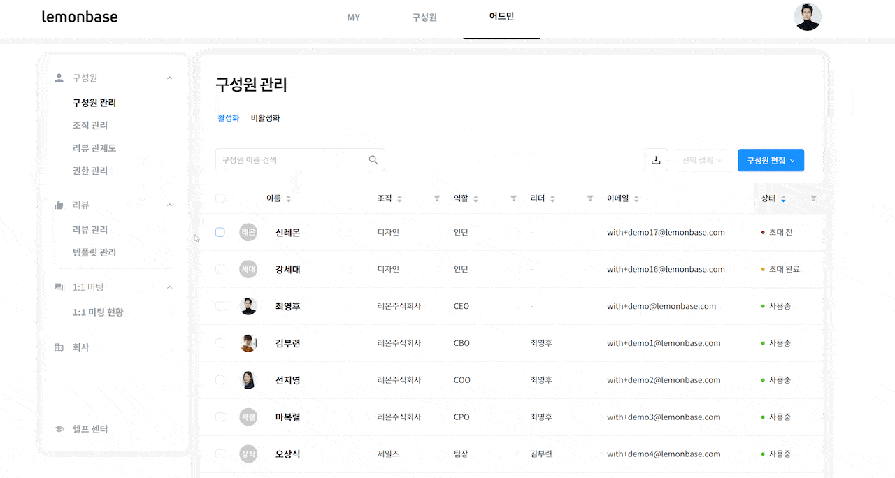
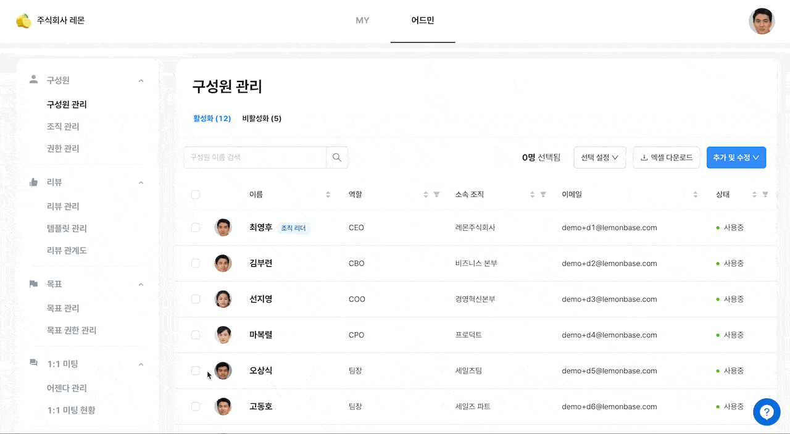

# 구성원 관리 이미지 압축

## 구성원 추가하기 

직원들이 레몬베이스에 가입하고 이용하려면 어드민이 **구성원 정보를 입력**하고 **초대**를 해야 합니다.

먼저 구성원을 추가하는 방법을 알려드릴게요. 엑셀로 여러 명을 한꺼번에 추가할 수도 있고, 한 명씩 추가할 수도 있어요.

#### **엑셀로 여러 명 추가하기**

1.  `어드민` > `구성원 관리` > `추가 및 수정` > `엑셀 파일로 일괄 추가 및 수정` 버튼을 클릭한 후 양식을 다운로드 받으세요.\

    <figure><figcaption></figcaption></figure>

 

<figure><figcaption></figcaption></figure>

2.  &#x20;엑셀 파일에 정보를 입력하고 저장한 뒤, `업로드하기`를 통해 엑셀파일을 업로드 하세요.

    <figure><figcaption></figcaption></figure>


[#undefined-1](faq.md#undefined-1 "mention")\
[#undefined](faq.md#undefined "mention")


#### **한 명씩 추가하기**

소수 인원의 구성원을 추가할 땐, 아래의 방법으로 진행하세요.


조직은 `어드민` > `조직 관리` 메뉴에서 미리 등록해야 선택할 수 있습니다.

[#undefined](organizations.md#undefined "mention")


## 구성원 초대하기 

구성원을 추가하셨다면, 이들이 레몬베이스에 가입할 수 있게끔 초대를 해야 합니다.

#### 초대 메일 보내기

1.  초대하고자 하는 구성원을 선택하고 `선택 설정` > `초대하기` 버튼을 눌러주세요.

    <figure><figcaption></figcaption></figure>
2.  구성원에게 **초대 메일**이 전송됩니다.

    
3. 초대 메일을 클릭하고 비밀번호를 지정하면 가입 완료!


초대 메일의 유효 기간은 **14일**입니다. \
14일이 지나도 아직 가입하지 않은 구성원이 있다면 초대 메일을 다시 보내주세요!



&#x20;초대 메일이 오지 않는다면 [이 문서](https://www.notion.so/d7642736c3c04e12807653597969aa21)를 참고해 주세요.


## 평가권자 지정하기 

#### 엑셀로 평가권자 지정하기

여러 명의 평가권자를 지정해야 한다면 구성원 등록 시, [#undefined-1](management-1.md#undefined-1 "mention")를 통해 빠르게 지정할 수 있습니다.

1. `어드민` > `구성원 관리` > `추가 및 수정` > `엑셀 파일로 일괄 추가 및 수정` 버튼을 클릭한 후 양식을 다운로드 받으세요.
2. ‘평가권자의 이메일’을 입력해 주세요.

<figure><figcaption></figcaption></figure>

#### **한 명씩 평가권자 지정하기**

1. `어드민` > `구성원 관리`에서 구성원을 선택하고  `선택 설정` > `평가권자 지정하기` 버튼을 클릭합니다.
2. 평가권자의 이름을 검색하여 지정해 주세요.


평가권자를 지정하면 리뷰 관계도가 자동으로 생성됩니다. \[어드민 > 리뷰 > 리뷰 관계도]를 확인하세요.

[#undefined](../reviews/organization-chart.md#undefined "mention")\



## 구성원 정보 수정하기 

구성원 추가하는 방법과 마찬가지로, 여러 명을 한꺼번에 수정하는 방법과 한 명씩 수정하는 방법이 있습니다.

#### **여러 명의 정보를 일괄 수정하기**

1. `어드민` > `구성원 관리` 페이지에서 `엑셀 다운로드` 버튼을 통해, 현재 등록되어 있는 구성원 데이터를 엑셀로 다운로드 받을 수 있습니다.

2. 기존에 구성원 정보를 등록한 엑셀 파일에서 변경 사항을 수정한 다음, 다시 엑셀로 업로드 해주세요.\
   **이메일 주소를 기준으로 새로운 정보가 덮어씌워집니다.** 이미 구성원이 등록되어 있는 상태에서 새로운 파일을 업로드해도 기존 구성원들은 남아있으니 안심하세요!

 

<figure><figcaption></figcaption></figure>


새로운 입사 직원이 있다면, 엑셀 파일에서 새로운 행에 추가하여 업로드 해주세요.


#### **한 명씩 수정하기**

수정하고 싶은 구성원의 **이름**을 클릭한 후, 프로필을 수정해 주세요.

## 계정 비활성화하기 

퇴사 또는 휴직한 직원이 있다면, 계정을 **비활성화** 해주세요. 원한다면 언제든 다시 활성화 상태로 변경할 수 있습니다다.

#### 1. 구성원별 비활성화하기

1. `어드민` > `구성원 관리`에서 비활성화 하고 싶은 구성원을 선택합니다.
2.  `선택 설정` > `계정` > `비활성화` 버튼을 클릭합니다.

    

    

     

    <figure><figcaption></figcaption></figure>

    

3.  다시 활성화 하고 싶은 경우, 비활성화 탭을 클릭한 후 위와 동일한 방법으로 활성화 시켜주세요.

    

    

     

    <figure><figcaption></figcaption></figure>

    

#### 2. 엑셀로 일괄 비활성화하기

1. `어드민` > `구성원 관리`에서 `구성원 목록 다운로드` 버튼을 눌러 현재 구성원을 다운로드 받아주세요.
2. 다운 받은 엑셀 파일의 마지막 열 `활성화 여부`에 변경할 상태를 입력해 주세요. (”활성화", “비활성화")
3. `구성원 편집` > `업로드하기`를 통해 새로운 엑셀 파일을 업로드 하면 상태가 반영됩니다!

## 계정 삭제하기 

소유자 혹은 ‘구성원 관리’ 권한을 가진 어드민은 레몬베이스에 등록된 구성원을 삭제할 수 있습니다.

#### 구성원 삭제는 언제 하나요?

* 테스트를 위해 생성한 계정을 관리할 경우
*   퇴사자의 개인정보를 파기해야할 경우

    : 개인을 식별할 수 있는 정보가 완전 삭제되며, 이름 / 호칭 / 이메일 / 비밀번호 / 전화번호 / 사번 등이 해당됩니다.

#### 구성원 삭제 방법


**삭제한 구성원은 절대 복구가 되지 않습니다.**\
&#x20;반드시 이 점 유의하여 구성원 삭제를 진행해 주세요!


1.  `어드민` > `구성원` > `구성원 관리` 페이지에 접속해 주세요.

    

    

     

    <figure><figcaption></figcaption></figure>

    

2.  `삭제할 구성원 이름` 클릭 > `계정 설정` > `계정 비활성화하기`를 통해 비활성화하세요.

    

    

     

    <figure><figcaption></figcaption></figure>

    

3.  ‘비활성화’탭에서 `삭제할 구성원 이름` 클릭 > `계정 설정` > `계정 삭제`를 통해 구성원을 삭제하세요.

    

    

     

    <figure><figcaption></figcaption></figure>

    

    

    

     

    <figure><figcaption></figcaption></figure>

    

#### FAQ

**Q. 구성원 삭제는 누가 할 수 있나요?**

소유자 혹은 ‘구성원 관리’ 권한을 가진 어드민이 구성원을 삭제할 수 있습니다.\

**Q. 실수로 구성원을 삭제했는데 복구할 수 있나요?**

불가합니다. 구성원을 삭제하는 즉시 데이터베이스에서도 삭제되기 때문에 절대 복구가 되지 않습니다. 구성원을 삭제하기 전, 삭제하려는 구성원이 맞는지 확인 후 신중하게 삭제해 주세요.\

**Q. 삭제한 구성원의 리뷰, 목표, 1:1 미팅 등의 데이터도 삭제되나요?**

레몬베이스에서 이용했던 데이터는 남아있습니다. 다만, 개인 정보가 삭제되기 때문에 화면에는 ‘삭제된 사용자’로 표시됩니다.\

**Q. 삭제한 구성원의 이메일로 새로 계정 생성이 가능한가요?**

네 가능합니다. 삭제한 구성원의 동일한 이메일로 등록한 구성원은 삭제한 구성원의 데이터와 별개로 새로운 계정으로 등록됩니다.

