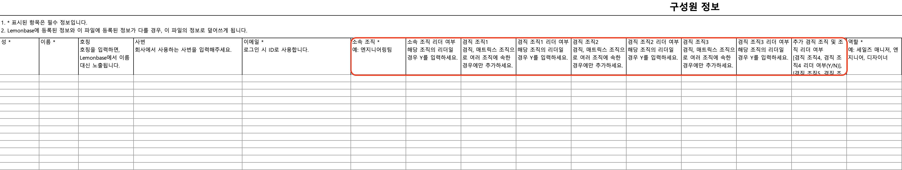
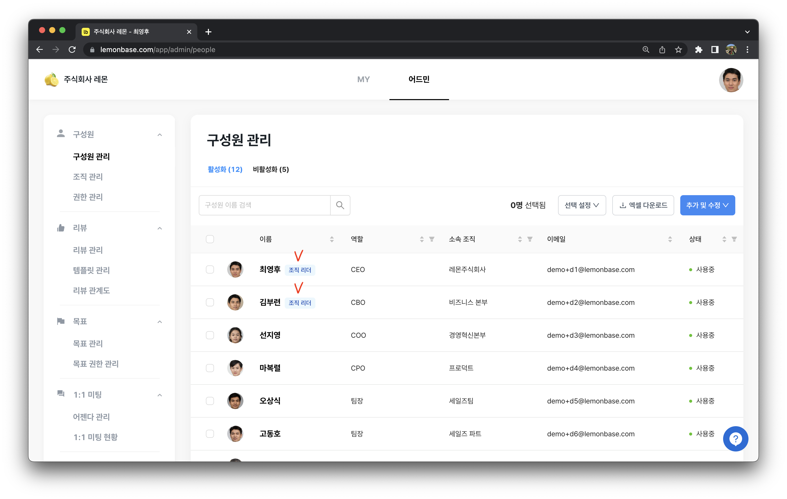
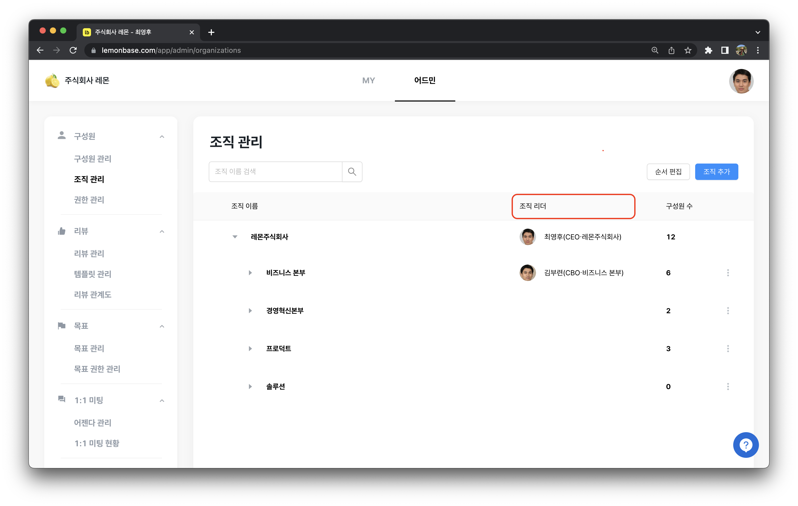

# 조직 관리

구성원 정보를 등록할 때 '조직'을 입력하셨나요?

조직별 인원을 쉽게 관리하고 싶다면 `조직 관리` 메뉴에서 **조직의 위계와 순서를 설정**해보세요!

## 조직 등록하기 

구성원 추가 시 조직을 함께 등록하게 됩니다.

<figure><figcaption></figcaption></figure>


구성원 등록 시, 엑셀 파일로 조직을 입력하여 업로드 하면 조직이 자동으로 생성됩니다.

겸직 조직이 3개를 초과한다면, \[추가 겸직 조직 및 조직 리더 여부] 에는 형식을 맞추어 업로드 해 주세요. → **\[겸직 조직, 겸직 조직 리더 여부] (예. `[레몬그룹 A팀, N], [레몬그룹 B팀, Y]`)**


## 조직의 위계 설정하기 

`조직 관리` 메뉴에서 조직의 위계를 설정해 보세요.

**순서 편집** 기능을 통해 조직의 **위계와 순서를 수정**하면, 회사 조직과 조직별 인원을 쉽게 관리할 수 있습니다.

<figure><figcaption></figcaption></figure>

## 조직 리더 설정하기 

#### 엑셀로 설정하기

1. `어드민` > `구성원 관리` > `추가 및 수정` 에서 엑셀 파일로 일괄 추가 및 수정을 눌러주세요.
2. 구성원 엑셀 업로드 시, 소속 조직 리더 여부에 Y를 체크해 주세요.

<figure><figcaption></figcaption></figure>

#### 한 명씩 설정하기

1. `어드민` > `구성원 관리`에서 ‘조직 리더’ 역할인 구성원을 새로 등록하거나 이미 등록이 되어 있다면 이름을 클릭한 뒤 `수정`을 눌러주세요.
2. 우측의 `조직 리더`에 체크하면, 이 구성원은 해당 조직의 ‘조직 리더’가 됩니다.

<figure><figcaption></figcaption></figure>


‘**조직 리더’ 관련 자주 묻는 질문**

* 소속 조직 리더는 1명만 지정 가능합니다.
* 한 명이 겸직 조직을 포함하여 최대 **20개**의 조직 리더가 될 수 있습니다. 겸직 조직 추가를 클릭하여 여러 개 조직의 리더로 설정하세요!


## 조직 리더 확인하기 

A. `어드민` > `구성원 관리`에서 ‘조직 리더’를 확인할 수 있습니다.

혹은 `엑셀 다운로드`를 통해서도 확인할 수 있습니다.

<figure><figcaption></figcaption></figure>

B. `어드민` > `조직 관리`에서 ‘조직 리더’를 확인할 수 있습니다.

<figure><figcaption></figcaption></figure>
