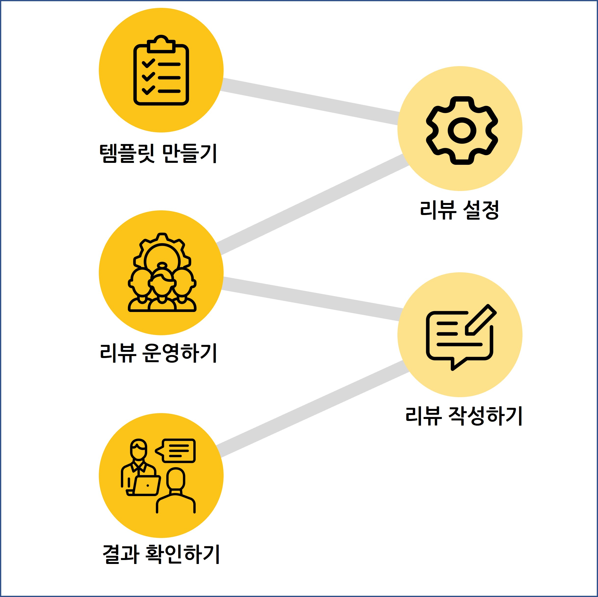

# 리뷰

### 우리 조직에 맞는 리뷰, 레몬베이스로 시작하세요.

레몬베이스 리뷰는 공정하고 객관적인 평가를 위한 기능들을 지원합니다.

역량/성과 평가, 다면평가, 신규 입사자 리뷰, 리더십 리뷰 등 다양한 목적의 리뷰를 설정해 보세요!

* 쉽고 직관적인 사용자 UI/UX
* HR 전문가가 설계한 템플릿 샘플 제공
* 리뷰 종류별 공개 설정 가능
* 선행 평가 참조를 통한 종합 평가 가능(다면 진단 및 N차 평가 등)
* 리뷰 결과 PDF/엑셀 다운로드 지원

<figure><figcaption></figcaption></figure>

### 리뷰는 어떻게 만드나요?

리뷰는 아래 순서에 따라 진행되고, 모든 과정은 ‘어드민’ 권한을 가진 분이 유연하게 운영할 수 있습니다.

**1) 템플릿 만들기 → 2) 리뷰 설정 → 3) 리뷰 운영하기 → 4) 리뷰 작성하기 → 5) 결과 확인하기**

<figure><figcaption></figcaption></figure>

### 리뷰 TIP

[평가는 성장을 지원하는 도구](https://camp.lemonbase.com/trends/review)

[다면평가, 나무가 아닌 숲을 보라](https://camp.lemonbase.com/column/360degreefeedback)

[캘리브레이션 미팅 가이드](https://camp.lemonbase.com/calibration-meeting)

