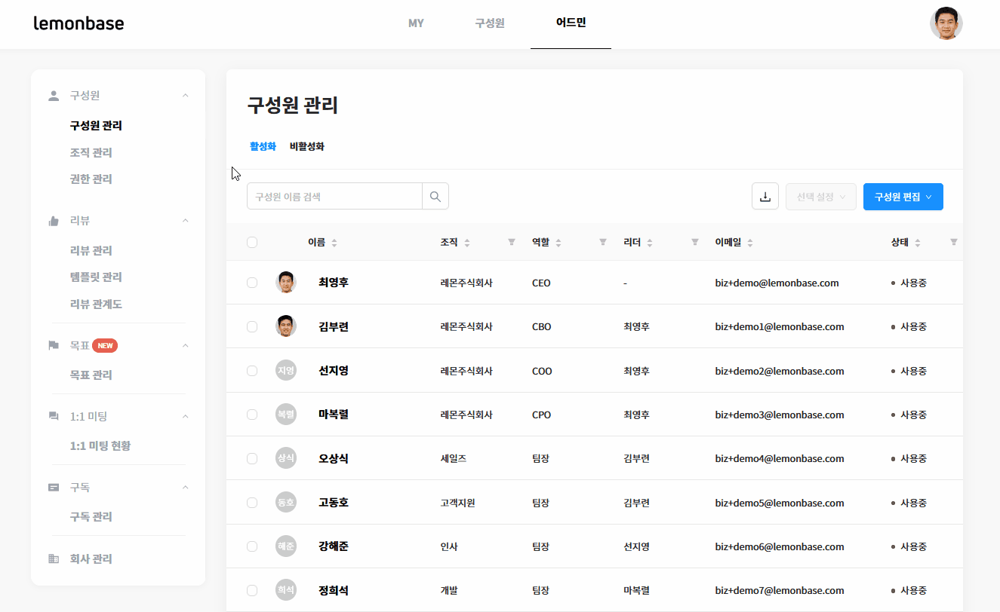

# 리뷰 관계도

## 리뷰 관계도는 무엇인가요? 

#### 리뷰 관계도란?

평가권자를 중심으로 생성된 조직도입니다.

구성원 정보 업로드 시 리더를 지정하면, 리뷰 관계도가 자동으로 생성됩니다.

* **상향/하향 리뷰** 진행 시, 리뷰 관계도에 따라 상/하향 작성자가 자동으로 지정됩니다.
  * 상향 리뷰 진행 시, 팀원이 직속 리더를 리뷰할 수 있도록 매칭됩니다.
  * 하향 리뷰 진행 시, 리더는 팀원을 리뷰할 수 있도록 자동으로 직속 리더와 팀원을 매칭시켜 드려요.
* 리더(차상위 포함)는 **팀원이 받은 리뷰를 열람**할 수 있습니다.
* **목표 추가/수정/삭제/체크인** 시 평가권자에게 알림 메일이 발송됩니다.


💡 직속 평가권자가 아닌 다른 사람이 리뷰를 해야 하나요?

&#x20;[이 문서](https://www.notion.so/21ecae8ac36442aaabd1393e01aa7c0e)를 참고하여 리뷰 작성자를 수기로 추가해 주세요!



**평가권자 지정**을 모두 마쳐야 리뷰 관계도가 완성됩니다.&#x20;

아직 평가권자 지정을 하지 않으셨다면 [이 문서](https://www.notion.so/223b34995723429981aa4928f563f2bc)를 참고해서, 평가권자를 먼저 지정해 주세요.


