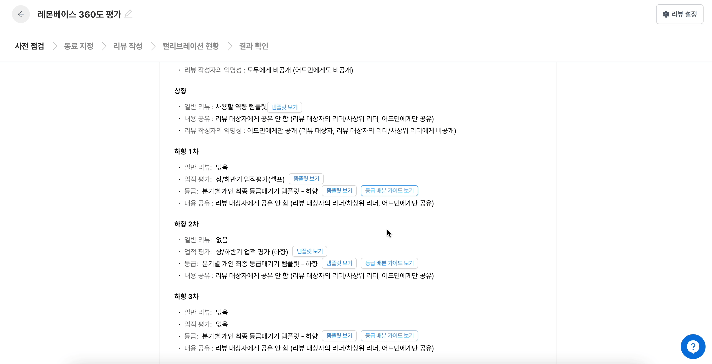

# 리뷰 만들기

`어드민` > `리뷰 관리` > `새로운 리뷰 만들기` 버튼을 눌러서 리뷰를 만들 수 있습니다.

<figure><figcaption></figcaption></figure>

## **이름** 

구성원들에게 보여질 리뷰 이름을 정합니다. 한눈에 알아보기 쉽게 목적과 기간을 함께 적어주세요!

## **대상자** 

* **리뷰를 받는 사람**을 의미합니다.&#x20;
* **모든 구성원**을 지정하면 조직원 전체가 리뷰를 받게 됩니다.
* **특정 구성원**을 지정하면 조직 별로 구성원을 체크하여 지정하거나 엑셀로 일괄 지정을 할 수 있습니다.

<figure><figcaption></figcaption></figure>

## **리뷰 선택** 

이 단계에서는 진행할 **리뷰의 종류**를 설정할 수 있어요.

진행할 리뷰를 여러 개 켜서 동시에 진행할 수도 있습니다. (셀프+동료+하향)

리뷰 유형은 **4가지**가 있습니다.

1. 셀프: 내가 **스스로에 대한** 리뷰를 작성합니다.
2. 동료: 지정된 **동료에 대한** 리뷰를 작성합니다. 직급 관계 없이 누구든 동료로 지정할 수 있습니다.
3. 상향: 하위 구성원이 **리더에 대한** 리뷰를 작성합니다.
4. 하향: 리더가 **하위 구성원에 대한** 리뷰를 작성합니다.

**캘리브레이션도 진행한다면, 가장 하단의 `캘리브레이션을`을 켜서 진행해 주세요!**

단, 캘리브레이션은 \[하향 평가] 진행 및 \[등급 템플릿]이 적용되어야 사용할 수 있습니다.

## 리뷰 설정 

미리 만들어둔 질문 템플릿을 여기에서 불러옵니다. 각 리뷰마다 각각의 템플릿을 적용시켜 주세요.

* 셀프, 하향 리뷰: 모든 유형의 템플릿을 동시에 or 선택적으로 적용할 수 있습니다.
* 동료, 상향 리뷰: '일반 리뷰 템플릿'의 유형만 적용할 수 있습니다.

.png>)

일괄평가(등급) 세팅하기

### 일괄평가란?

* 하향 평가자가 평가해야 할 대상이 많고
* 대상자의 등급만 매기거나 보정해야 할 때
* 대상자의 등급을 한 판에서 보며 일괄로 매기는 기능입니다.

### 일괄평가 화면 구성

본인이 평가자라면, 아래와 같은 평가 현황 화면을 보게 됩니다.

이 화면에서 등급을 매길 대상자를 선택하고, `일괄 평가` 버튼을 클릭하면 등급을 일괄로 매길 수 있습니다.

일괄 평가 버튼을 클릭하면, 등급 조정 화면으로 진입하게 됩니다.

이 화면에는 직전 차수 평가자가 매긴 등급에 따라 대상자가 배치되어 있습니다.

직전 차수 평가자가 매긴 **등급에서 조정이 필요한 경우**, 대상자 카드를 드래그하여 원하는 등급으로 옮기면 됩니다. **등급 조정이 필요하지 않은 경우**, 대상자 카드를 그대로 두시면 직전 차수 평가자가 매긴 등급 그대로 확정됩니다.

#### 일괄평가를 하기 위해선 무엇이 필요한가요?

1. 일괄평가는 **하향 리뷰 진행 시에만 가능**하므로, 하향 리뷰 설정을 켜 주세요.
2. 일괄평가 해야 하는 평가자에게는 단일 템플릿으로 `등급 템플릿` 만 적용되어 있어야 합니다.
   1. 하향 1차: 일반 리뷰 템플릿 + 업적 평가 템플릿 + 등급 템플릿
   2. 하향 2차: 업적 평가 템플릿 + 등급 템플릿
   3. 하향 3차: 등급 템플릿 **→ 하향 3차 평가자만 일괄평가 가능**

#### 자주 묻는 질문

**Q. 최종 평가자는 실질적으로 평가를 하진 않고, 등급만 보정하는 역할인데 일괄평가 기능을 사용해도 되나요?**

* **`Yes`** 일괄평가는 등급별로 대상자를 배열하여, 등급 보정을 쉽게 진행할 수 있는 기능이므로 목적에 따라 활용해 주시면 됩니다.

**Q. 일괄평가로 등급을 모두 확정하고 나면 캘리브레이션은 못하나요?**

* **`No`** 리뷰를 생성할 때 캘리브레이션 옵션을 켰다면, 일괄평가로 모든 차수의 하향 리뷰 작성자가 등급을 제출한 후 캘리브레이션 가능합니다.

리뷰 총점 기능 사용하기

`셀프 리뷰` 및 `하향 리뷰`에서 사용하는 \[일반 리뷰 템플릿]과 \[업적 평가 템플릿]에 ‘가중치’를 넣어서 각 리뷰에 총점을 매길 수 있습니다.

구성원들의 `셀프/하향 리뷰` 총점 계산에 도움을 줄 수 있어요.

❗ 리뷰 총점 계산은 `셀프 리뷰`와 `하향 리뷰`에서만 사용이 가능합니다.

### 리뷰 총점 기능이란?

`셀프/하향 리뷰`를 구성하는 \[일반 리뷰]와 \[업적 평가]에 가중치를 넣어서 셀프/하향 리뷰의 총점을 계산해주는 기능입니다.

💡 (예시)

1. A 구성원의 \[셀프 일반 리뷰 점수 80점] \[셀프 업적 평가 점수 90점]
2. \[일반 리뷰 40%] \[업적 평가 60%]의 가중치로 셀프 리뷰의 총점을 계산하고 싶다면?

\= (셀프 일반 리뷰 점수 80점 X 일반 리뷰 40%) + (셀프 업적 평가 점수 90점 X 업적 평가 60%)

⇒ 셀프 리뷰 총점 86점을 계산해주는 기능

### 리뷰 총점 사용하는 방법

#### 1) 리뷰 설정에서 템플릿 가중치 선택하기

1. `새로운 리뷰 만들기` > `리뷰 설정` 에서 ‘등급’ ‘환산 점수’ ‘가중치’가 있는 \[일반 리뷰 템플릿]과 \[업적 평가 템플릿]을 선택해주세요. \
   해당 템플릿 선택 시, 자동적으로 `템플릿 가중치 (선택)` 창이 생성됩니다.

⚠️ 하나의 템플릿이라도 \[등급]과 \[가중치]가 존재하지 않으면, `템플릿 가중치 (선택)` 창이 생성되지 않습니다.&#x20;

각 리뷰에 필요한 \[등급과 가중치가 있는 템플릿의 설정]에 대해 궁금하다면 [이 문서](https://www.notion.so/5569facad2c64b6a9619b4536ff7a114)를 확인해주세요!

2. 템플릿 가중치 선택을 하면, `셀프/하향 리뷰` 내의 \[일반 리뷰 템플릿]과 \[업적 평가 템플릿]에 대한 가중치를 설정할 수 있습니다.

🚨  **가중치의 합은 100%가 되어야 합니다.**

#### 2) 사전 점검 단계에서 가중치 설정 확인하기

앞서 설정한 `셀프/하향 리뷰`의 \[일반 리뷰] 및 \[업적 평가]에 대한 가중치를 \[사전 점검] 단계에서 한번 더 확인할 수 있습니다.

### 리뷰 총점 확인하는 방법

* 구성원은 리뷰 작성 페이지에서 리뷰 총점을 확인할 수 있습니다.
* 어드민은 \[리뷰 작성] / \[결과 확인] 단계에서 엑셀을 다운 받은 후, 해당 엑셀 내에서 확인할 수 있습니다.

#### **1) 구성원 - 리뷰 작성 페이지**

1. \[일반 리뷰]의 질문 응답을 완료하면, 해당 리뷰에 대한 점수를 \[일반 리뷰]의 마지막 질문 하단에서 확인이 가능합니다.

2. \[업적 평가]도 마지막 업적 작성 칸 하단에서 업적 평가 점수를 확인할 수 있습니다.

3. 리뷰 작성 페이지 맨 하단에 \[일반 리뷰 점수]와 \[업적 리뷰 점수]에 가중치를 부여한 `셀프/하향 리뷰`의 총점을 확인할 수 있습니다.

&#x20;⚠️ \[결과 확인] 단계에서는 \[일반 리뷰 점수] 및 \[업적 평가 점수]와 더불어 `셀프/하향 리뷰 총점` 확인이 불가합니다.

#### 2) 하향 평가자 - 리뷰 작성페이지

하향 리뷰 작성을 완료하면, 한 번에 자신이 평가한 내용을 바탕으로 평가 대상자들의 총점을 확인할 수 있습니다.

#### 3) 어드민 - \[리뷰 작성] / \[결과 확인] 단계에서 엑셀 다운로드

1. \[리뷰 작성] 및 \[결과 확인] 단계에서 엑셀 다운로드를 해주세요.

2. 엑셀의 \[총점] 시트에서 `리뷰 종류`, `일반 리뷰 템플릿 점수`, `업적 평가 템플릿 점수`, `종합 총점`을 확인하실 수 있습니다.

동료 지정 방식 설정 (동료 리뷰를 진행하는 경우)

동료 리뷰 작성자를 지정하는 방식입니다.

총 3가지 방식이 있고, 어떤 방식을 택하더라도 어드민은 중간에 지정된 동료를 변경할 수 있습니다.

💡 동료 지정 옵션에 따른 자세한 내용이 궁금하다면 [이 문서](https://www.notion.so/18d3046ca1a54d8492b00e259583ec9b)를 참고하세요.

#### **리뷰를 주는 동료 숫자**

동료 리뷰를 진행한다면, **대상자에게 몇 명의 동료가 리뷰를 쓰게 할 건지** 최소/최대 범위를 정해주세요.

리뷰 대상자 본인/리더가 동료를 지정하는 옵션에선, 어드민이 설정한 범위 내에서 지정하도록 안내 됩니다.

`* 리뷰 대상자가 지정 > 리뷰 써주고 싶은 동료 선택 시에는 적용되지 않습니다.`

등급 배분율 가이드 설정하기

등급 배분율 가이드는 하향 리뷰 진행 시, 평가 등급별로 인원을 분배하고자 할 때 비율을 설정할 수 있는 기능입니다.

⚠️ 등급배분율 진행하기 전 반드시 확인해야할 주의사항

`[등급 템플릿]을 사용해야 [등급 배분율 기능]을 사용할 수 있습니다.`

[등급 템플릿 만드는 법](https://www.notion.so/d00bbc08f7ca4d7a88b0ff0f476f2a3d)

#### 등급 배분율 가이드 설정하기

1. 등급 배분율 가이드는 `하향 리뷰` 에서 사용할 수 있습니다.

2. 등급 배분 가이드를 사용하기 위해서는 `등급 배분 가이드 버튼을 ON` 해주세요

3. 등급 배분율 가이드는 **`등급 템플릿`** 을 사용해야 합니다. 등급 템플릿 중 코멘트만 사용한 템플릿은 배분가이드 적용이 안됩니다.

4. 배분율의 합은 100%가 되어야 합니다. 100%가 되지 않으면 다음 단계로 넘어가지 못합니다.

5. 배분율은 0과 양의 정수로만 입력할 수 있습니다. 소수점으로 비율 설정이 어려우며, 소수점으로 설정할 경우 자동으로 반올림 됩니다.

6. 사전점검 단계에서도 등급 배분 가이드를 확인할 수 있습니다.

#### 리뷰 작성자 화면에서 등급 배분 가이드 확인하기

1. 리뷰 작성자의 하향리뷰 화면에서 설정해 놓은 등급 배분 가이드를 확인할 수 있습니다.

2. 하향리뷰 작성자 일괄 평가 화면 상에서도 등급 배분 가이드를 확인할 수 있습니다.

⚠️ 일괄 평가 단계에서는, 어드민이 설정한 등급 배분 가이드와 별개로, 리뷰 작성자가 등급 배분 가이드를 수정할 수 있습니다.

3. 하향 평가 리뷰 작성 화면에서 등급 분포 및 등급 배분 가이드를 확인할 수 있으며, 구성원들의 리뷰 제출 현황도 한 눈에 확인 할 수 있습니다.

## 참고 정보 

참고정보란 무엇인가요?

리뷰 작성 화면 우측에는 `참고 정보` 영역이 있습니다.

참고 정보를 통해 리뷰 대상자가 지금까지 작성한 셀프 리뷰와 받은 리뷰들을 보면서 리뷰를 작성할 수 있어요.

모든 리뷰 내용이 보이는 건 아닙니다. **나에게 열람 권한이 있는 리뷰만 보여요**.

예를 들어 내가 팀장이라면 팀원이 받은 리뷰를 볼 수 있고, 내가 팀원이라면 팀장이 다른 사람들에게 받은 리뷰를 볼 수는 없어요.

참고 정보 설정에서는 리뷰 작성 시 참고 정보 영역에 어떤 내용을 보여줄 지를 정합니다. 동료, 하향 리뷰 시에는 좀 더 구체적으로 설정할 수 있어요.

주요 케이스로 예시를 들어볼게요.

#### 동료 리뷰

*   **동료의 셀프 리뷰 내용을 바탕으로 피드백을 주는 경우**

    동료의 셀프 리뷰를 보면서 이 사람이 어떤 업무를 했는지 확인하고 리뷰를 작성하는 경우가 있습니다.

    이 때, 동료 리뷰의 `동료 리뷰 작성자에게 대상자의 셀프 리뷰 내용 공개` 옵션을 선택해 주세요.\

    <figure><figcaption></figcaption></figure>


동료 리뷰 작성자에게 대상자의 셀프 리뷰 내용을 공개할 경우, 추가 설정을 할 수 있습니다.

<업적 평가 내용 공개>&#x20;

‘리뷰 설정’에서 ‘업적 평가 템플릿’이 적용된 경우에만 설정이 가능합니다. 업적 평가 템플릿의 내용을 동료 리뷰 작성자에게 열람 여부를 결정합니다.

<리뷰 내용에서 등급은 제외>

&#x20;대상자의 셀프 리뷰 중 등급은 보여주지 않고 코멘트 내용만 공개하고 싶을 때 선택합니다.


#### 하향 리뷰

*   **평가권자가 360도 리뷰 내용을 종합하여 하향 리뷰를 작성하는 경우**

    셀프, 동료, 상향 리뷰를 먼저 작성한 후에 평가권자가 이 리뷰 내용들을 보며 종합적으로 리뷰를 하는 경우가 있습니다. 이 때, 하향 리뷰 `두 번째 옵션`을 선택해 주세요.
*   **다른 팀 사람이 하향 리뷰를 작성하는 경우 / 매트릭스 조직의 경우**

    겸직, TF 조직, 매트릭스 조직이 있다면, 직속 평가권자는 아니지만 (ex. TF 리더) 하향 리뷰를 작성하는 경우가 있습니다. 이 때 팀원의 리뷰 내용을 보면서 작성한다면, `세 번째 옵션`을 선택해 주세요.

    
* **참고 정보 설정의 첫 번째 옵션**
  * 리더(평가권자)는 팀원이 이전에 받았던 리뷰 중 결과가 공유된 것들만 볼 수 있습니다.
* **참고 정보 설정의 두 번째 옵션**
  * 리더(평가권자)는 팀원이 이전에 받았던 리뷰 중 결과가 공유된 것들을 볼 수 있습니다.
  * 리더(평가권자)는 팀원이 현재 ‘리뷰 작성’ 단계의 리뷰 중 제출된 것들을 볼 수 있습니다.
* **참고 정보 설정의 세 번째 옵션**
  * 하향 리뷰 작성자가 리뷰 대상자의 리더(평가권자)거나, 리더(평가권자)가 아닌 경우
    * 리더(평가권자)는 ‘참고 정보 설정의 두 번째 옵션'과 동일한 권한을 가집니다.
    * 리더(평가권자)가 아닌 작성자는 아래의 권한을 가집니다.
      * 리뷰 대상자가 현재 ‘리뷰 작성' 단계의 리뷰 중 제출된 것들을 볼 수 있습니다.
      * 겸직, TF 조직, 매트릭스 조직 등 여러 명의 리더가 리뷰를 해야 한다면 이 옵션을 선택해 주세요.

## 공개 설정 

#### 공개 설정 - 리뷰 내용

이 옵션에서는 리뷰 대상자에게 리뷰 결과를 공유할지 여부를 선택할 수 있습니다.

#### 공개 설정 - 작성자의 이름

**동료 또는 상향** 리뷰를 진행한다면, 리뷰 작성자 이름의 공개 범위(=익명성)를 선택할 수 있어요.

## 결과 공유 

리뷰 결과를 대상자에게 공유하는 경우, **누가 결과를 공유할 건지** 정해주세요.

결과 공유 방식에는 2가지 방식이 있습니다.

* **리더(직속 평가권자)가 공유**
  * 리뷰 대상자에게 리뷰 결과를 전달하기 전 리더`(직속 평가권자)의 검토`가 필요할 때 선택
* **어드민이 바로 공유**
  * 직속 평가권자의 검토 없이 어드민이 **`평가권자와 리뷰 대상자에게 동시에 공유`**하고 싶을 때 선택


💡 리뷰가 모두 제출된 후, 어드민이 `공유하기` 버튼을 눌러야 평가권자 또는 대상자에게 결과가 보여집니다.&#x20;

`공유하기`를 클릭하지 않으면 아무에게도 결과가 공유되지 않아요!


## 일정 

리뷰 시작일, 종료일, 동료 지정, 리뷰 작성 기간 등을 정할 수 있어요.

리뷰 시작 후에도 언제든 일정 변경이 가능하며, 일정을 끄고 리뷰를 진행하실 수도 있습니다.

#### **시작일**

어드민이 계획하는 리뷰 시작일을 넣어주세요. 이 날짜는 구성원에게 별도로 안내되지 않아요.

#### **동료 지정**

동료를 지정할 수 있는 기간을 넣어주세요.&#x20;

구성원들이 동료를 지정한다면, 동료를 지정하라는 메일이 발송되며 기간이 표시됩니다.&#x20;

어드민이 동료를 지정한다면, 메일이 발송되지 않습니다.

#### **리뷰 작성**

리뷰 유형별로 작성 기간을 넣어주세요.&#x20;

**구성원들은 작성 기간 내에만 리뷰를 제출**할 수 있습니다. 작성 기간이 도래하지 않았다면 임시 저장만 가능합니다.

#### **결과 확인 / 공유**

어드민과 평가권자가 리뷰 결과를 확인하고 리뷰 대상자에게 공유하는 기간을 정해주세요.&#x20;

평가권자가 팀원에게 리뷰 결과를 공유하는 경우, 공유 안내 메일에 기간이 표시됩니다.

#### **종료일**

어드민이 계획하는 리뷰 종료일을 넣어주세요. 이 날짜는 구성원에게 별도로 안내되지 않아요.


💡 일정을 설정하더라도, 일정에 맞춰 자동으로 단계가 넘어가진 않아요.&#x20;

어드민이 `다음 단계 시작하기` 버튼을 눌러야 다음 단계가 진행됩니다.


