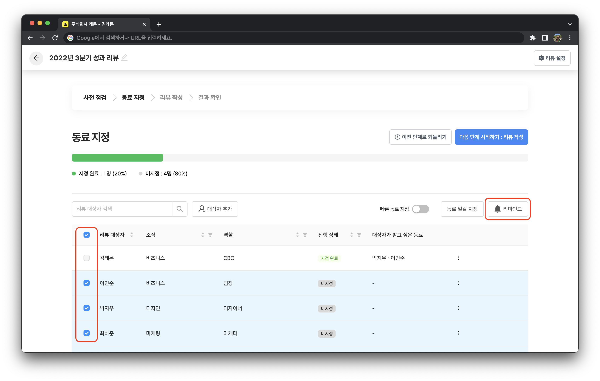

# 리뷰 진행하기

리뷰를 생성했다면, 아래의 단계로 진행할 수 있습니다.

각 단계를 시작하는 것은 자동으로 진행되지 않아요. 어드민이 각각의 단계를 직접 시작해 주셔야 합니다.

**\[사전 점검 > 동료 지정(동료 리뷰 진행 시) > 리뷰 작성 > 캘리브레이션(진행 시) > 결과 확인]**

## 사전 점검 

리뷰를 본격적으로 시작하기 전, 설정을 제대로 했는지 점검하는 절차가 있습니다.

**공개 범위, 익명성, 참고 정보** 등 중요한 설정들을 다시 한 번 체크하여 실수를 방지할 수 있습니다.

#### 리뷰 설정 점검

수정할 부분이 있다면 `리뷰 설정` 버튼을 눌러 수정할 수 있습니다.

리뷰 시작 후에는 **세부 옵션 변경이 일부 제한**되니, 사전 점검 단계에서 꼼꼼하게 체크해 주세요.

(리뷰 시작 후 변경이 불가능한 옵션: 리뷰 종류, 템플릿 교체, 동료 지정 방식)

#### 리뷰 대상자 확인 및 상/하향 리뷰 작성자 지정

하단에는 **리뷰 대상자**와 **상/하향 리뷰 작성자** 목록을 확인할 수 있습니다.

이 단계에서는 `상향/하향 리뷰 작성자`를 지정하거나 수정할 수 있어요! (동료 리뷰 작성자는 다음 단계에서 가능)

상/하향 리뷰 작성자의 경우, 리뷰 설정 단계에서 지정한 대상자와 평가권자 관계를 기반으로 자동으로 매칭 됩니다.

리뷰 작성자 변경이 필요하다면, 리뷰 대상자를 클릭하여 수정해 주세요!


작성자 수정 후에는 `확인` 버튼을 눌러주셔야 수정이 완료됩니다.


#### 상/하향 리뷰 작성자 엑셀 업로드

`사전 점검` 단계에서 엑셀 파일로 한 번에 업로드 하면 파일에 포함된 사람이 자동으로 지정됩니다.

**상/하향 리뷰 작성자 엑셀 업로드는 '사전 점검' 단계에서만 가능**하니 꼭 확인해 주세요!\
(한 명씩 수정은 '리뷰 작성' 단계에서도 가능해요.)

#### 다음 단계 시작하기 : 동료 지정 or 리뷰 작성

모든 준비와 점검이 끝났다면, 다음 단계로 시작해볼까요?

`시작하기` 버튼을 누르면 설정에 따라 구성원들에게 메일이 발송됩니다!

[구성원에게 언제 메일이 발송되나요?](https://www.notion.so/48579601db1a4605974dd670dd71a4bf)

## 동료 지정 

어드민은 누가 누구를 동료로 지정했는지, 누가 아직 지정이 안 되었는지 확인하고 수정할 수 있습니다.

#### 동료 지정 리마인드 하기

아직 동료 지정이 되지 않은 구성원이 있나요?

`미지정` 상태인 구성원 이름의 좌측 체크박스를 체크 > `리마인드` 버튼을 눌러 리마인드 메일을 보내세요!

동료 지정 방식에 따라 동료를 지정할 사람에게 메일이 발송됩니다.

#### 동료 수정하기

동료 지정을 수정하거나 대신 지정해야 하나요?

(1) `빠른 동료 지정` 버튼을 클릭하고 동료를 수정해보세요.

(2) 혹은 `동료 일괄 지정 버튼`을 눌러 엑셀 양식을 업로드하여 지정할 수도 있습니다.


**어드민이 동료를 수정**하면 **최종 지정**이 완료됩니다.&#x20;

이후에는 리뷰 대상자 또는 직속 평가권자가 동료를 지정할 수 없으니 유의해 주세요!


#### 다음 단계 시작하기 : 리뷰 작성

동료 지정이 완료되었다면 리뷰 작성 단계로 넘어가 주세요.

`시작하기` 버튼을 누르면, 구성원들에게 리뷰를 작성하라는 내용의 메일이 발송됩니다.

[구성원에게 언제 메일이 발송되나요?](https://www.notion.so/48579601db1a4605974dd670dd71a4bf)

## 리뷰 작성 

리뷰 작성 단계를 시작하셨다면, 구성원들은 이제 리뷰를 작성하고 제출할 수 있게 됩니다.

어드민의 리뷰 작성 현황판에선 아래와 같은 기능을 수행할 수 있습니다.

#### **제출 현황 확인하기**

어드민은 누가 리뷰를 제출했고, 누가 아직 제출하지 않았는지 현황을 확인할 수 있습니다.

`리뷰 대상자/작성자 기준`으로도 살펴볼 수 있어요!

#### 미제출자에게 **리마인드**

`리마인드` 버튼을 눌러 리뷰 종류별로 미제출자를 확인하고, 알림을 보낼 인원만 선택하여 리뷰를 작성하라는 안내 메일 혹은 슬랙 메시지를 발송할 수 있습니다.

.png>)

#### 제출된 **리뷰 내용 확인 및 수정하기**

리뷰 대상자가 리뷰를 ‘제출한 시점'부터 어드민은 내용을 확인할 수 있습니다.

`리뷰 대상자 기준`에서 구성원을 클릭하면 해당 구성원이 받은 리뷰 내용을 볼 수 있으며, 어드민은 권한이 있을 경우 리뷰를 대신 제출하거나 내용을 수정할 수 있습니다.

[리뷰 작성 및 수정 권한 설정하기](https://www.notion.so/065b8a6198ba4adba63f2781a1a0c01e)

.png>)

#### 다음 단계 시작하기 : 캘리브레이션 현황 or 결과 확인

리뷰 작성이 완료되었다면 다음 단계로 넘어가 주세요.

캘리브레이션을 진행하지 않아서, 다음 단계가 결과 확인 단계인 경우

`시작하기` 버튼을 누르면, 구성원들에게 리뷰를 작성하라는 내용의 메일이 발송됩니다.

[구성원에게 언제 메일이 발송되나요?](https://www.notion.so/48579601db1a4605974dd670dd71a4bf)

.png>)


💡 리뷰 미제출자가 있어서 다음 단계로 넘어가는 게 어려우신가요? [이 문서](https://www.notion.so/b1a475ec058f49fa830485e2ca1ea99b)를 참고하세요.


## 캘리브레이션 현황 

리뷰 작성이 모두 끝났다면, 캘리브레이션을 시작하세요.

이 단계는 소유자/리뷰 권한이 있는 어드민만 가능합니다.


**`캘리브레이션 진행하기 전 반드시 확인해야할 주의사항`**

`[캘리브레이션]` 단계를 시작하면, 더 이상 \[리뷰 작성] 단계로 되돌아 갈 수 없으니 모든 리뷰를 마친 뒤 진행해 주세요!


1.  캘리브레이션을 진행할 리뷰 대상자를 체크한 뒤, `캘리브레이션 시작하기` 버튼을 눌러주세요.\

    <figure><figcaption></figcaption></figure>
2.  테이블에서 조직/역할 등 **정렬과 필터 기능**을 사용할 수 있어요!

    .png>)
3.  `등급 배분 설정`을 통해, 현재 캘리브레이션을 진행하고 있는 인원에 대한 등급별 최대 인원 수를 설정하세요.\

    <figure><figcaption></figcaption></figure>
4.  등급을 조정할 사람의 카드에 왼쪽 마우스를 누른 상태에서 변경할 등급으로 끌어오세요. (드래그앤드랍)\
    \

    <figure><figcaption></figcaption></figure>


&#x20;조정 사유에 대한 코멘트도 남길 수 있어요.&#x20;

&#x20;이 코멘트는 캘리브레이션 현황을 볼 수 있는 어드민에게만 공개됩니다.


4.  캘리브레이션을 완료했다면, `저장 및 완료` 버튼을 눌러주세요.\

    <figure><figcaption></figcaption></figure>

#### 다음 단계 시작하기 : 결과 확인

캘리브레이션이 완료되었다면 결과 확인 단계로 넘어가 주세요.

.png>)

.png>)

#### \[결과 확인] 단계에서 캘리브레이션 등급 수정하기

\[결과 확인] 단계에서는 캘리브레이션 등급을 수정할 수 없습니다.

만약 캘리브레이션 등급 수정을 원한다면, `이전 단계로 되돌리기` 버튼을 눌러주세요.

.png>)

.png>)

## 결과 확인 

리뷰 작성을 마친 후 결과를 공유해 주세요. 결과를 공유하는 방식은 **3가지**가 있습니다.

#### **리더가 공유**

(어드민 → 리더(직속 평가권자) → 리뷰 대상자)

1. 구성원을 선택한 후 `리더에게 공유하기` 버튼을 클릭하세요.
2. 선택한 사람들의 리더들(평가권자)에게 이메일이 발송되며, 리더(평가권자)는 하위 구성원의 리뷰를 볼 수 있습니다.

.gif>)

#### **어드민이 바로 공유**

어드민 → 대상자에게만 공유 or 리더(평가권자)와 리뷰 대상자에게 동시 공유

1. 구성원을 선택한 후 `리뷰 대상자와 리더에게 공유하기` 버튼을 클릭하세요.
2. 리뷰 대상자와 그들의 리더(평가권자)에게 이메일이 발송됩니다. 이후부터 대상자 본인과 리더(평가권자)는 리뷰 결과를 확인할 수 있습니다.

<figure><figcaption></figcaption></figure>


💡 아무에게도 공유하고 싶지 않고 어드민만 결과를 확인하고 싶으신가요?&#x20;

`공유하기` 버튼을 누르지 않으면 누구에게도 공유되지 않습니다!


### 리뷰 내용 수정하기 

#### **리뷰 작성 단계에서 수정하기**

리뷰 대상자를 클릭하면 리뷰 대상자가 받은 리뷰를 확인할 수 있습니다.

수정하고자 하는 리뷰를 클릭하여 하단의 `수정하기` 버튼을 통해 내용을 수정해 주세요.

.png>)

#### **결과 확인 단계에서 수정하기**

⚠️ 캘리브레이션 등급은 어드민도 수정이 불가합니다.

리뷰 대상자를 클릭한 뒤 `수정하기` 버튼을 통해 내용을 수정해 주세요.

리뷰 작성자가 여러 명인 경우, 리뷰 작성자를 먼저 선택하면 `수정하기` 버튼이 나타납니다.

.png>)

리뷰가 이미 공유되었다면, `공유 취소` 후 리뷰 수정이 가능합니다.

<figure><figcaption></figcaption></figure>


💡 **A가 B에게 작성한 리뷰를 수정하려면 어디에서 수정해야되나요?**

`어드민 > 리뷰 관리`에서는 리뷰 대상자 기준으로 리뷰 대상자가 받은 리뷰들이 보입니다. 따라서, **리뷰 대상자 B를 클릭하여 A가 작성한 리뷰 내용을 수정**해 주시면 됩니다.


### 리뷰 종료하기 

결과 확인 단계에서 `리뷰 종료` 버튼을 누르면 리뷰가 종료됩니다.

#### **리뷰 종료를 하면 무엇이 달라지나요?**

* 더 이상 결과 공유를 할 수 없습니다.
* 리뷰 목록의 상태가 ‘종료'로 표시됩니다.

.png>)

#### **리뷰 종료를 취소할 수 있나요?**

* 가능합니다. 리뷰를 종료한 후 **다시 활성화**할 수 있습니다.
* 리뷰 미제출자가 뒤늦게 리뷰를 제출해야 하는 경우, `리뷰 다시 활성화하기` 버튼을 누른 후 진행해주세요.

.png>)

