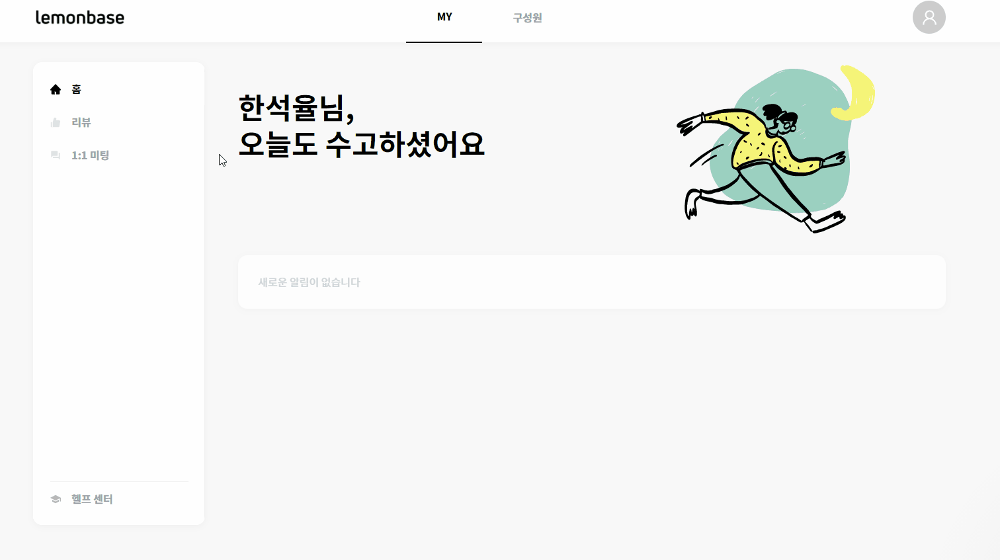
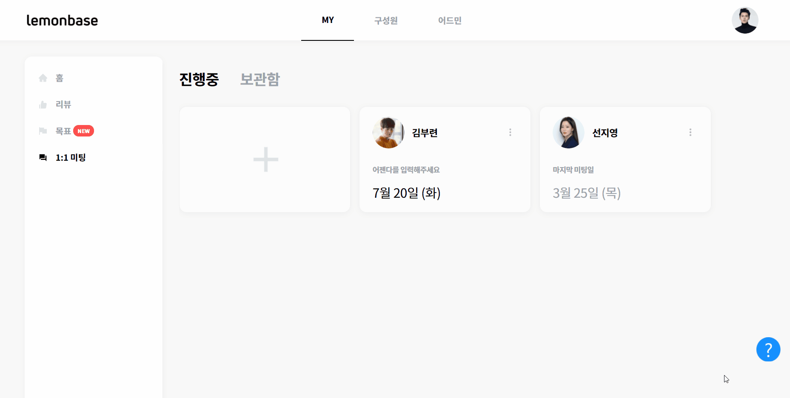

# 1:1 미팅

## 미팅 보드 생성 

1:1 미팅 보드는 효과적인 미팅을 도와줍니다.

상대와 **미팅 보드를 공유**하고 **일정을 정해보세요!**

1.  1:1 미팅을 하고 싶은 상대와 보드를 만드세요. 미팅 상대를 선택한 뒤 여러 일자의 미팅을 하나의 보드에서 관리할 수 있습니다.

    
2.  미팅을 생성하면 오늘 날짜로 자동 지정됩니다. `일정 변경` 버튼을 눌러 자유롭게 일정을 변경하세요. 다음 미팅 일정도 미리 정할 수 있어요.

     (2).gif>)
3.  좌측의 `+` 버튼을 누르시면 새로운 미팅 일정을 만들 수 있어요.

     (6).png>)

## 어젠다/코멘트/메모 작성 

1:1 미팅을 진행하기 전, **미팅 어젠다**를 미리 준비해 주세요.

업무 관련 내용이 아니어도 좋아요! 이야기 나누고 싶은 주제를 적어보세요.

1. 우측의 '참고 정보' 에서 아래 내용을 확인하고 어젠다를 작성해 주세요.
   1. **추천 어젠다:** 성장, 몰입, 협업, 성과, 업무, 목표, 평가 관련 100여개의 질문들이 마련되어 있습니다.
   2. **리뷰:** 내가 리더라면, 팀원이 받은 리뷰 내용을 볼 수 있습니다.

2. `코멘트 추가` 버튼을 눌러 상세한 내용을 적어보세요.

.gif>)


💡 어젠다는 나와 상대방 누구나 작성할 수 있으며, 어젠다 내용은 어드민에게도 공개됩니다.


어젠다를 미리 작성하고, 1:1 미팅을 진행하면서

1:1 미팅의 **논의 내용, 액션 아이템, 아이디어** 등을 메모로 남길 수 있습니다.\

<figure><figcaption></figcaption></figure>


**공유 메모**는 미팅 **상대방**과 **어드민**에게 공개됩니다.&#x20;

**비공개 메모**는 본인만 볼 수 있습니다. (어드민도 열람 불가)


## 미팅 보드 보관하기 

보드에서 더 이상 보고 싶지 않은 혹은 진행하지 않는 1:1 미팅이 있다면 보관함을 사용하세요.

`1:1미팅` > `진행중` 보드로 이동하세요. 보관함으로 이동하고 싶은 미팅의 우측 상단에 있는 `보관함으로 이동하기` 버튼을 누르세요.

다시 보드에서 보고 싶다면 `보관함` > `다시 시작하기` 버튼을 눌러주세요.

####

## 미팅 알림 보내기 

1:1 미팅 스케줄을 생성/변경할 때, 어젠다 등록 후에 상대방에게 알림을 보낼 수 있습니다.

미팅 알림은 어떻게 수신할 수 있나요?

1:1 미팅 알림은 총 3가지 경로를 통해 수신할 수 있습니다.

**(1) 레몬베이스 메인 페이지 알림**

**(2) 메일 알림**

**(3) 슬랙 알림 👉 슬랙 연동 시에만 적용됩니다. (참고:** [#undefined-1](../admin/setting/integration/slack.md#undefined-1 "mention"))

#### 생성 알림 보내기

1.  1:1 미팅 보드가 생성되고, 알림 선택 팝업이 뜹니다. 상대방에게 1:1 미팅 일정 알림을 보낼지 여부를 선택해 주세요.

    .png>)
2. `보내지 않기`를 클릭하면 1:1 미팅 일정 알림을 보내지 않고, 1:1 미팅 당일 오전 8시에만 알림이 갑니다.
3. `알림 보내기`를 클릭하면 즉시 1:1 미팅 일정이 생성되었음을 상대방에게 알려줄 수 있고, 1:1 미팅 당일 오전에도 알림이 한 번 더 발송됩니다.

#### 미팅 일정 변경 알리기

1. 일정을 변경할 1:1 미팅 날짜를 클릭합니다.
2.  상단의 `일정 변경`을 클릭하여 1:1 미팅 일정을 변경합니다.

    .png>)
3.  1:1 미팅 일정이 변경되고, 알림 선택 팝업이 뜹니다. 상대방에게 변경된 일정에 대한 알림을 보낼지 여부를 선택해 주세요.

    .png>)
4. `보내지 않기`를 클릭하면 1:1 미팅 일정 변경 알림을 보내지 않고, 1:1 미팅 당일 오전 8시에만 알림이 갑니다.
5. `알림 보내기`를 클릭하면 즉시 1:1 미팅 일정이 생성되었음을 상대방에게 알려줄 수 있고, 1:1 미팅 당일 오전에도 알림이 한 번 더 발송됩니다.

#### 어젠다 등록 후 알리기

1.  1:1 미팅 전, 상대방과 이야기 할 어젠다와 코멘트를 입력해 주세요.\

    <figure><figcaption></figcaption></figure>
2.  어젠다와 코멘트를 입력한 후, `종 모양 아이콘`을 클릭하여 상대방에게 알림을 보낼 수 있습니다.\

    <figure><figcaption></figcaption></figure>
