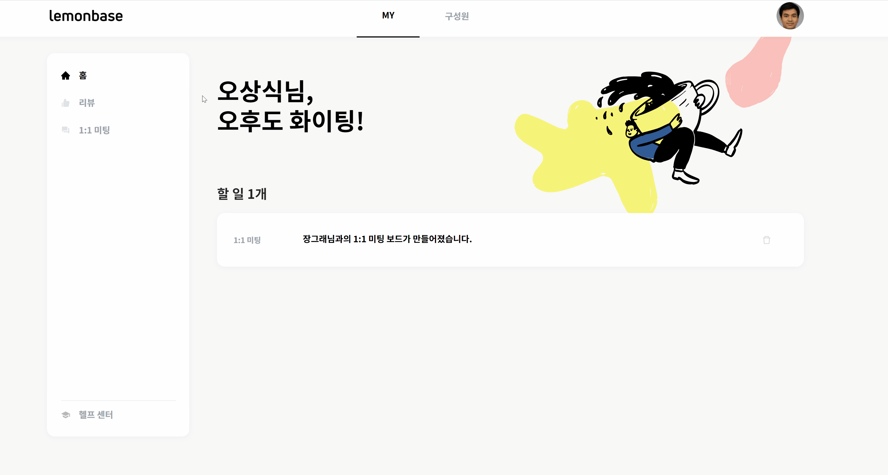
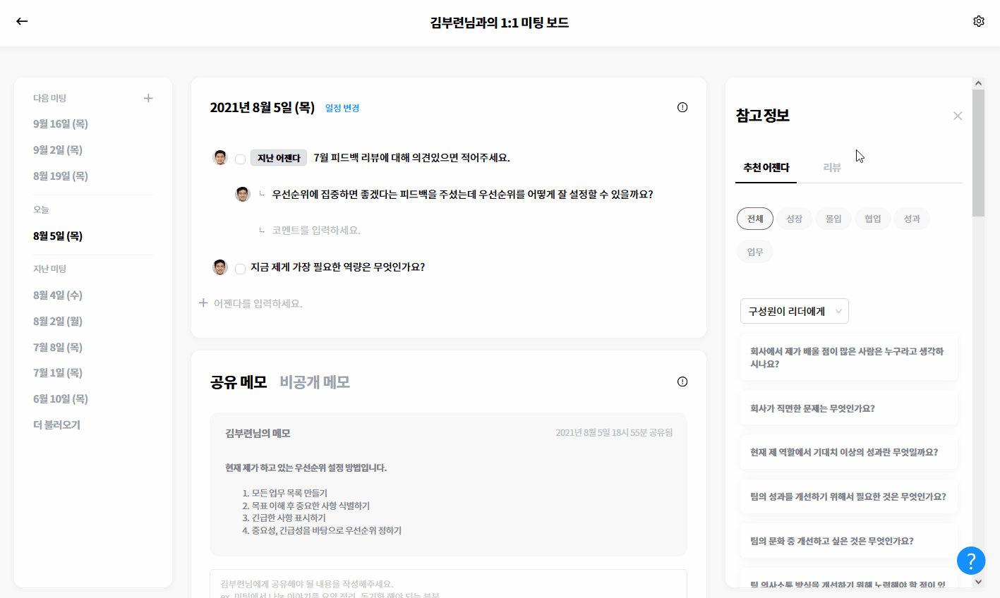

# 구성원을 위한 시작 가이드

## 구성원을 위한 시작 가이드 

먼저, 레몬베이스에 **가입**한 후 **리뷰를 작성**하는 방법, **목표 수립 및 달성도를 체크**하는 방법, **1:1 미팅을 진행**하는 방법을 알려드릴게요.

### 1. 가입 

#### 초대 메일을 통해 가입하세요

레몬베이스 초대 메일을 받으셨나요? 메일을 클릭하고 비밀번호 설정하기 버튼을 누르고 비밀번호만 지정하면 가입 완료!

.gif>)


💡 초대 메일을 못 찾겠다면 메일 제목 또는 발신자를 검색해 보세요.

* 메일 제목: \[레몬베이스] `회사명`에서 `이름`님을 초대했습니다.
* 발신자 주소: [automated@lemonbase.com](mailto:automated@lemonbase.com)

초대 메일의 유효 기간은 **14일**입니다. 14일이 지났다면 사내 관리자에게 초대 메일을 다시 보내 달라고 요청해 주세요.


### 2. 리뷰 

#### 리뷰를 작성하세요

리뷰를 작성하라는 메일을 받으셨나요? `리뷰 작성하기` 버튼을 클릭하여 내가 작성해야 하는 리뷰 페이지에 들어가세요. 좌측엔 내가 리뷰를 써줘야 하는 사람들 목록이 있고, 우측엔 지난 리뷰 데이터 등의 참고 정보가 나와 있어요. 내용을 입력하면 **임시 저장**도 되니, 편하게 작성하세요.

🔍 [자세히 보기](https://www.notion.so/5dddb4df8fba46f8941c1b110d95c8ff)

.gif>)

#### 리뷰 결과를 확인하세요

리뷰 제출이 모두 끝난 후 어드민 또는 리더가 리뷰 결과를 공유하면, **내가 받은 리뷰**와 **팀원들이 받은 리뷰** 내용을 볼 수 있어요. `MY` > `리뷰` 페이지에 들어가 원할 때 언제든지 확인해 보세요.

🔍 [자세히 보기](https://www.notion.so/c9827858b1f14b4d8100257eac755b87)

### 3. 목표 

#### 목표와 핵심 과제를 추가하세요

어드민(사내 담당자)이 목표 사이클을 만들었나요? 그렇다면, 목표 페이지에서 내가 담당하고 있는 목표 또는 핵심 과제를 추가해 보세요.

🔍 [자세히 보기](https://www.notion.so/78e0f346f96946c0ae2b3229e9f16e2c)

.gif>)


💡 **핵심 과제에 무엇을 입력하나요?** \
**MBO 방식**을 운영하신다면, **KPI**(핵심 성과 지표)를 넣어주시고, \
**OKR 방식**을 운영하신다면, **KR**(핵심 결과)을 넣어주세요.


#### 달성 현황을 체크인 하세요

우측의 체크인 아이콘을 눌러보세요. 현재의 목표 달성 수치를 입력하시면, 진척도는 자동으로 계산됩니다.

.png>)

또한, 목표 체크인 할 때 **진행 상황에 대한 구체적인 배경 및 근거를 코멘트로 남기고** 목표를 달성해가는 과정을 확인하세요!

🔍 [자세히 보기](https://www.notion.so/d8f6cc8475e6417b9a7d372c3b36776b)

 (3).png>)

### 4. 1:1 미팅 

#### 1:1 미팅 보드를 만들고 진행해 보세요

`MY` > `1:1 미팅` 을 클릭하여 내 리더 또는 팀원과의 미팅 보드를 만들고 어젠다, 코멘트, 메모 등을 남겨 보세요!

🔍 [자세히 보기](https://www.notion.so/1-1-eae5dad173b2474fb1c2253e7d8e29c5)

<figure><figcaption></figcaption></figure>
